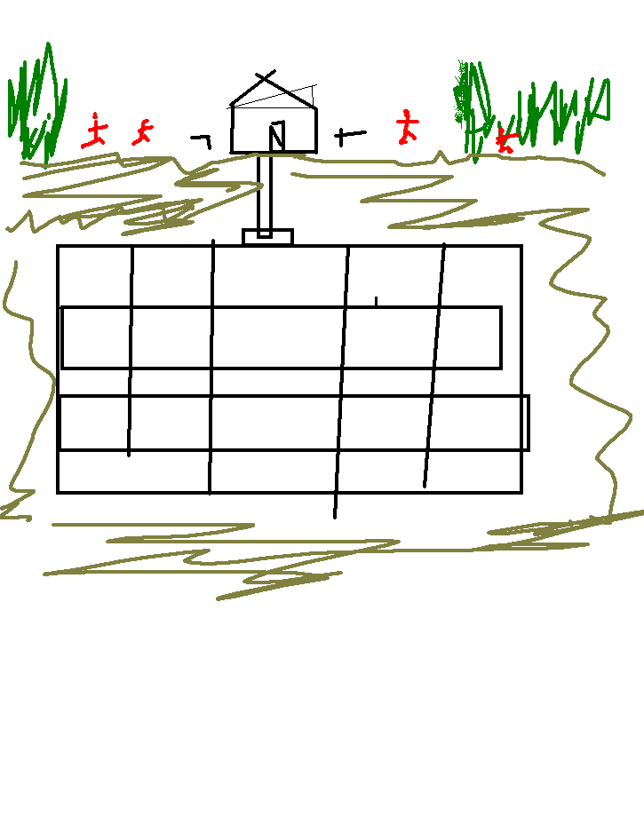

# 🛡️ BUNKER PROTOCOL: 2D Zombie Survival Defense

Game 2D survival bunker cross-section terinspirasi dari sketsa arsitektur bunker bawah tanah dan rumah kabin di tengah hutan.



---

## 🌲 Konsep & Desain Permainan

### 1. Permukaan (Surface Level)
- **Hutan Lebat (Kiri & Kanan)**: Tempat zombie muncul dan mengintai. Terkadang hanya berupa zombie penyusup kecil, namun radar akan memperingatkan sebelum gelombang besar (*horde*) tiba.
- **Rumah Kabin**: Bangunan pertahanan di tengah dengan atap segitiga, cerobong asap, pintu berbarikade, dan jendela observasi. Berfungsi sebagai pos komando atas dan akses turun ke bunker melalui elevator shaft.
- **Turet Otomatis (Auto-Defense Sentry Turrets)**:
  - Dipasang di sisi kiri dan kanan rumah (`¬` dan `+` pada sketsa).
  - Memiliki fitur auto-target dan auto-fire ke zombie yang mendekat.
  - Membutuhkan amunisi! Jika amunisi habis, turet akan membunyikan klik kering dan berhenti menembak hingga diisi ulang.
  - Dapat di-upgrade (Sentry 9mm ➔ Twin Autocannon ➔ Vulcan Minigun ➔ Heavy Plasma Cannon).

### 2. Bunker Bawah Tanah (Underground Bunker Complex)
Terdiri dari 4 lantai vertikal dengan 16 ruangan fungsional yang dipisahkan oleh poros lift (*elevator shaft*) di tengah:

| Lantai | Kiri 1 | Kiri 2 | Poros Lift | Kanan 1 | Kanan 2 |
|---|---|---|---|---|---|
| **Lantai 1** | Airlock Depot | Munitions Armory *(Fokus Amunisi)* | 🛗 Lift | Security & Radar Station | Medical Clinic |
| **Lantai 2** | Living Quarters A | Hydroponics Farm *(Makanan)* | 🛗 Lift | Water Filtration *(Air)* | Mess Hall / Kitchen |
| **Lantai 3** | Living Quarters B | Fabrication Workshop *(Metal & Repair)* | 🛗 Lift | Chemical & Powder Lab *(Mesiu)* | Research Tech Lab |
| **Lantai 4** | Diesel Generator *(Listrik)* | Bio-Fuel Refinery *(Bahan Bakar)* | 🛗 Lift | Deep Mine *(Metal & Belerang)* | Air & Life Support |

---

## 🎮 Cara Menjalankan & Memainkan Game

### Opsi 1: Menjalankan Langsung di Browser
Buka terminal dan jalankan server lokal:
```bash
python3 /content/bunker_survival/server.py 8080
```
Lalu buka `http://localhost:8080` pada browser Anda.

### Opsi 2: File HTML Standalone
Tersedia file mandiri tanpa dependensi:
- `/content/bunker_survival_standalone.html`
Anda dapat langsung membukanya di browser apa saja (Google Chrome, Firefox, Safari, Edge).

### Opsi 3: Di Dalam Google Colab / Notebook Cell
Cukup jalankan di dalam cell:
```python
import play_game
play_game.show()
```

---

## 🕹️ Panduan & Kontrol Permainan

- **Klik Ruangan Bunker**: Menampilkan detail ruangan, menugaskan kru (*survivors*), dan meng-upgrade ruangan untuk meningkatkan hasil produksi.
- **Klik Turet (Kiri/Kanan)**: Melihat spesifikasi senjata, mengisi amunisi (*Reload*), memperbaiki kerusakan (*Repair*), atau meningkatkan tier senjata (*Upgrade*).
- **Tombol R atau Reload**: Cepat mengisi ulang amunisi turet dari persediaan bunker.
- **Spasi**: Pause / Lanjutkan permainan.
- **Angka 1, 2, 3**: Mengubah kecepatan simulasi (1x Normal, 2x Cepat, 5x Sangat Cepat).
- **Tombol 🌲 Expedition**: Mengirim penyintas melakukan pencarian barang bekas (*scrap*), peti amunisi, atau menyelamatkan penyintas baru dari hutan.
- **Tombol 🔬 Tech Tree**: Meneliti teknologi penting seperti *Automated Ammo Conduit* (pengisian amunisi turet otomatis langsung dari bunker!).
